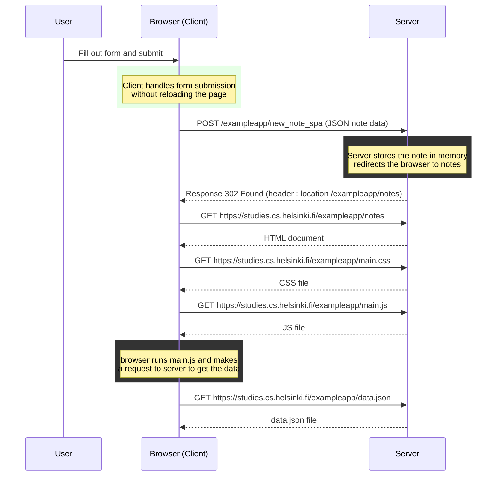

# solutino to 0.4: New note diagram

- mermaid code :

```mermaid
sequenceDiagram
    participant User
    participant Client as Browser (Client)
    participant Server

    User->>Client: Fill out form and submit

    rect rgb(230, 255, 230)
    Note over Client: Client handles form submission<br/>without reloading the page
    end

    Client->>Server: POST /exampleapp/new_note_spa (JSON note data)

    rect
    Note over Server: Server stores the note in memory <br> redirects the browser to notes
    end

    Server-->>Client: Response 302 Found (header : location /exampleapp/notes)


    Client->>Server: GET https://studies.cs.helsinki.fi/exampleapp/notes
    Server-->>Client: HTML document

    Client->>Server: GET https://studies.cs.helsinki.fi/exampleapp/main.css
    Server-->>Client: CSS file

    Client->>Server: GET https://studies.cs.helsinki.fi/exampleapp/main.js
    Server-->>Client:  JS file

    rect
    Note over Client: browser runs main.js and makes <br> a request to server to get the data
    end


    Client->>Server: GET https://studies.cs.helsinki.fi/exampleapp/data.json
    Server-->>Client:  data.json file

```
